# 👋 Olá, eu sou Yago Grégio

**Estudante de Desenvolvimento de Sistemas | Front-end & Back-end**

Sou estudante de Desenvolvimento de Sistemas no **SENAI-SP** e do ensino médio em Jaguariúna, Brasil.

Tenho interesse em desenvolvimento **front-end e back-end**, buscando evoluir através de projetos práticos, estudos e novas tecnologias.

---

## 🚀 Sobre mim

* 🎓 Estudante de Desenvolvimento de Sistemas — SENAI-SP
* 💻 Focado em desenvolvimento web
* 🌱 Atualmente aprimorando meus conhecimentos em JavaScript
* 🔧 Aprendendo e utilizando Git & GitHub
* 🎯 Buscando transformar ideias em projetos funcionais
* 🇧🇷 Brasil

---

## 🛠️ Tecnologias & Ferramentas

### Linguagens

  

### Front-end

  
  

### Ferramentas

  
  

---

## 📚 Atualmente estudando

* JavaScript
* HTML5
* CSS3
* Git
* GitHub
* Desenvolvimento Front-end
* Desenvolvimento Back-end

---

## 📊 GitHub

  
  

---

## 🔥 Atividade

  

---

## 🎯 Objetivos

* Aprofundar JavaScript
* Desenvolver projetos web mais completos
* Aprender desenvolvimento back-end
* Trabalhar com bancos de dados
* Aprender novas linguagens e frameworks
* Construir um portfólio sólido
* Contribuir para projetos open source

---

## 📫 Entre em contato

  
  

---

  <i>"Transformando ideias em código, um projeto de cada vez."</i>

  © Yago Grégio

